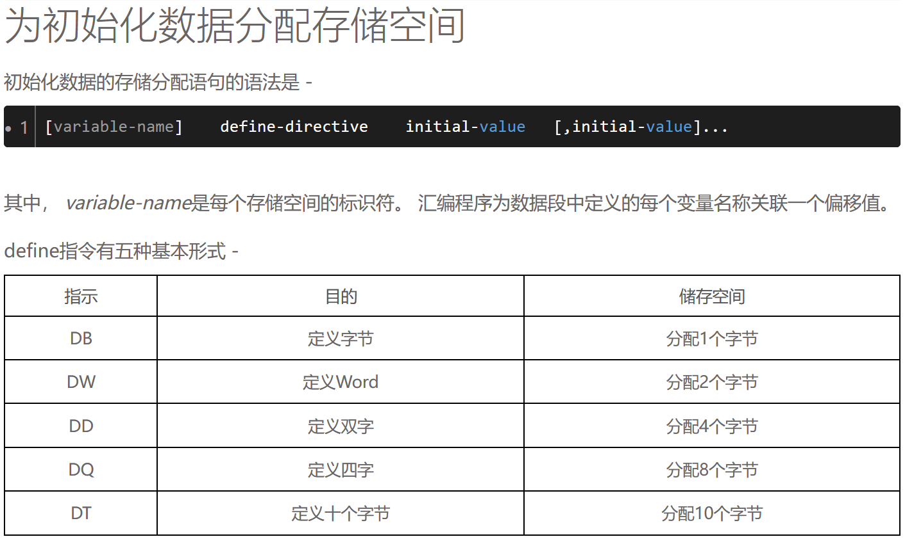

*开始之前你可能需要 Google 了解的概念： assembler, BIOS*


>- assembler : 汇编语言
>- BIOS : Basic Input and Output System. 即基本输入输出系统。BIOS是个人电脑启动时加载的第一个软件。启动时按esc(视电脑型号，按键可能不同)进入的界面  


**目的： 创建一个文件 BIOS 将文件识别为一个可引导的磁盘**

这是非常令人兴奋的，我们将创建我们自己的引导扇区！ 

理论基础
------

计算机上电启动后，首先运行主板 BIOS 程序， BIOS 并不知道如何加载操作系统，所以 BIOS 把加载操作系统的任务交给引导扇区。  

>机械硬盘是圆形的，将圆形按角度分开再由内到外分开，一个小块即为一个扇区，理解为硬件层面的储存单位(多为512B)
>希望了解更多，前往 https://zhuanlan.zhihu.com/p/117375905

因此，引导扇区必须放在一个已知的标准位置，这个位置就是磁盘的第一个扇区(cylinder 0, head 0, sector 0) 该扇区一共占用 512 字节。  

>此处的扇区指您的bin文件，即编译出来的系统文件，Emulator会将其识别为一个硬盘

为了确保 “磁盘是可引导的” BIOS 会检查扇区的第 511 和 512 字节是不是 `0xAA55`.

下面就是最简单的引导扇区：

```
e9 fd ff 00 00 00 00 00 00 00 00 00 00 00 00 00
00 00 00 00 00 00 00 00 00 00 00 00 00 00 00 00
[            29行，每行16个 '0' 字节            ]
00 00 00 00 00 00 00 00 00 00 00 00 00 00 55 aa
```

你看到的基本上都是 0，最后以 16 位的 `0xAA55` 结束。(注意字节顺序， x86 是小端结构)。开头的三字节表示计算机进入一个无限循环。

最简单的引导扇区
-------------------------

你可以使用一个二进制编辑器编写上 512 字节数据，或者简单的编写一段汇编代码：

>当然是写代码拉-_- 在 `W:\os` 下创建新的文本文档并改名为 `boot_sect_simple.asm` 注意请连同后缀名一起修改

```nasm
; 无限循环 (对应上面二进制中的e9 fd ff) 
loop:
    jmp loop 

; 填充进（510-前面代码大小的长度(e9 fd ff)）个0
; 为什么是510？因为一个扇区有512字节而我们需要最后两个字节是奇妙咒语
times 510-($-$$) db 0
; 奇~妙的咒~语 (使BIOS识别为引导扇区)
dw 0xaa55 
```

> 你可能在其他地方看见的程序都是大写，没错，asm语言的大部分标识符不区分大小写

>我知道你开始看不懂了，什么都不知道就贴代码确实很吓人，所以我来讲讲asm基本的语法
>- 分号之后的一整行是注释，编译时会忽略，只是给 人类 看的
>- loop:   与c++和c一致，一个什么东西加上冒号就是一个标记，loop可以替换为你自己的名字（比如jojo）
>- jmp loop   跳转至标记处，所以你看，不就无限循环了吗
>- times a b  将接下来a位填充进b
>- db   定义操作数占用的字节数，这里用于将0标志为一个数值而不是指令
>- dw   定义两字节空间，这里将接下来两个字节替换为0xaa55，对应上文二进制文件的55 AA  
>-关于变量定义：（来自iowiki : https://iowiki.com/assembly_programming/assembly_variables.html）  
>   
>   
>   
>- $     表示当前行被汇编后的地址。  
>- $$      表示一个节的开始处被汇编后的地址。


编译
`nasm -f bin boot_sect_simple.asm -o boot_sect_simple.bin`

OSX 提醒： 如果这里出现错误，请重新阅读 00 章节

我知道你一定迫不及待的想运行一下 (我也是!)，那么我们开始运行它：

`qemu boot_sect_simple.bin`

有些系统下，你可能需要运行 `qemu-system-x86_64 boot_sect_simple.bin` 如果出现 SDL 错误， 传递 --nographic 或者 --curses 参数给 qemu 程序。

>
>哇哇哇，看来又到我了，要开始运行了？   
>来到 `W:\os` 右键开启命令行，或者win+r开启命令行cd到这里，麻烦点  
>```
>.\NASM\nasm.exe boot_sect_simple.asm -o boot_sect_simple.bin -f bin
>```
>这样可以生成一个名为 `boot_sect_simple.bin` 的文件，用二进制编辑器打开可以看见和上文的二进制一样  
>由于我们写的是x86_64的系统，请运行  
>```
>.\qemu-windows\qemu-system-x86_64.exe .\boot_sect_simple.bin
>```

你将会看到一个窗口打印 "Booting from Hard Disk..." 然后就没有然后了。你最后一次看到无限循环还非常的兴奋是什么时候？ ;-)
