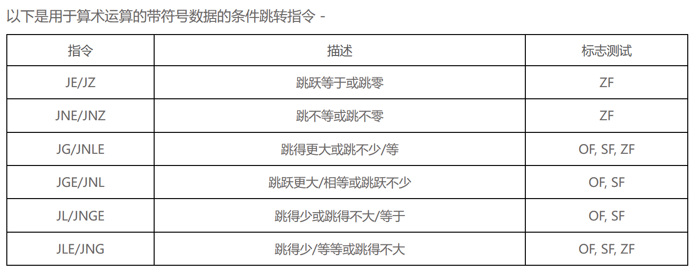
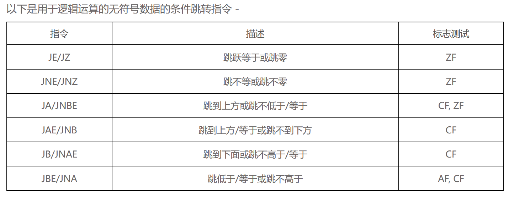
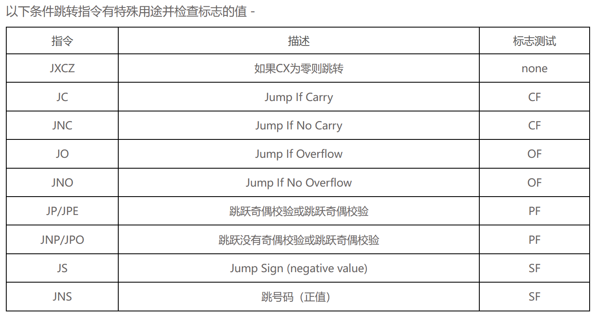

*开始之前你可能需要 Google 了解的概念： control structures, function calling, strings*

> control structures : 流程图，一种图像，可以清晰的表示条件分支和循环
> 一个小小例子:
> ```mermaid
> graph TD;
>     A-->B;
>     A-->C;
>     B-->D;
>     C-->D;
>     D-->A;
> ```
> function calling : 函数调用，不了解什么是函数请重上初二
> strings : 字符串

**目的： 学会使用汇编完成基础代码（循环和函数）**

我们离最后可用的引导程序只有一步之遥。

在第七个教程中，我们会学习如何从磁盘读取数据，这也是我们加载内核前的最后一步。但是在那之前，我们仍然需要学习编写一些控制代码，函数调用和使用字符串。
在接触磁盘和内核之前我们需要尽快熟悉这些内容。

字符串
-------

定义字符串和定义字节数据一样，但是我们为字符串添加一个空字节（C 语言也是这样，使用 \0 作为字符串结尾）。
因为这样我们就知道我们的字符串在哪儿结束。

```nasm
mystring:
    db 'Hello, World', 0
```

请注意被单引号包围的文本会被汇编器转换成 ASCII 码，最后那个 0 会被直接当成 0x00 处理。

> 单双引号在asm中等价
> 'Hello' => 'H' 'e' 'l' 'l' 'o' '0x00'

控制流程
------------------

我们已经使用过一个控制流程 `jmp $` ，跳转到自己来完成一个无限循环。

汇编语言中跳转条件是基于 *上一条* 指令的计算结果，例如：

```nasm
cmp ax, 4      ; 对比ax和4
je ax_is_four  ; je：当上方cmp的两个参数等价时执行
jmp else       ; jmp：当上方cmp的两个参数不等价时执行（也可用作无条件跳转）
jmp endif      ; 到endif

ax_is_four:
    .....
    jmp endif

else:
    .....
    jmp endif  ; 并不是十分必要，但是为了美观还是写一下吧

endif:
```

首先在大脑里抽象出需要代码执行的流程，然后使用上面的模式将自己的流程用汇编语言实现。

这里面有很多 `jmp` 条件： if equal, if less than, etc. 这些都是很直观的流程，你也可以使用 Google 更好的了解它们

> 
> 
> 
> 三幅截图来自 [iowiki](https://iowiki.com/assembly_programming/assembly_conditions.html)

函数调用
-----------------

和你预想的一样，函数调用就是跳转到一个固定的标记位置。

唯一棘手的问题是参数传递，目前我们可以通过两种方式来传递我们的参数：

1. 程序员知道函数间共享的一个寄存器或者内存地址
2. 需要更多的代码来避免函数间的影响

第一种方式非常简单，我们可以预先指定我们使用 `al` (实际上是 `ax`) 寄存器来存储参数。

```nasm
mov al, 'X'
jmp print
endprint:

...

print:
    mov ah, 0x0e  ; tty code
    int 0x10      ; I assume that 'al' already has the character
    jmp endprint  ; this label is also pre-agreed
```

尽管这种方式可以达到我们传递参数的目的，但是这样会是程序变得杂乱无序。这里的 `print` 函数只能返回到 `endprint`。如果其他函数想要调用它怎么办？这样就没办法达到代码重用了。 

正确的解决方案提供了两处改进：

- 我们会存储返回地址以便被多个函数调用并正确返回
- 我们同时保存当前的所有寄存器状态，让子函数可以修改寄存器而不会影响到别的函数

CPU 会帮助我们存储返回地址，使用 CPU 指令 `call` 和 `ret` 来代替 `jmp` 完成函数调用。

CPU 同样有单独的指令来保存寄存器状态到栈： `pusha` 和对应的 `popa`，可以自动保存所有寄存器信息到栈中并完全恢复到最初的状态。

> ~~真方便，不是吗~~

包含外部文件
------------------------

我假设你是一个程序员而且不需要我来告诉你这样做的好处。

> 好处就是方便维护和添加功能，再说512byte肯定放不下整个操作系统

汇编语法就是这样
```nasm
%include "file.asm"
```

打印十六进制数据
-------------------

在下一章节的课程中我们会学习如何从磁盘中读取数据，我们需要确认我们读取到了正确的数据。文件  `boot_sect_print_hex.asm`
改进了 `boot_sect_print.asm` 来打印十六进制数据而不是字符串。


代码！ 
-----

> 文件变多了，但是智能的nasm会帮我们编译文件中include的其他asm文件
> 你的bat还能用！
> 记得还是运行 `.\compile_and_boot.bat boot_sect_main` ，只要对主文件运行就行

现在我们分析一下代码。 `boot_sect_print.asm` 通过 `%include` 指令被主程序包含，主程序以子程序的方式调用它。它使用循环来打印字符串到屏幕。同时包含了一个可以打印换行的函数类似 `'\n'` 的其实是两个字符。换行符 `0x0A` 和回车符 `0x0D`。你可以做个试验，去掉回车符看看代码是如何影响打印结果的。

> 是的，换行和回车不一样:(

如上所述 `boot_sect_print_hex.asm` 可以打印十六进制数据。

主程序文件 `boot_sect_main.asm` 定义了一些字符串和字节数据，调用 `print` 和 `print_hex` 函数后就挂起了。 如果你已经理解了前面的章节，那么这段代码就很容易看懂了。

> 恭喜你，站起来活动活动，喝口热水吧